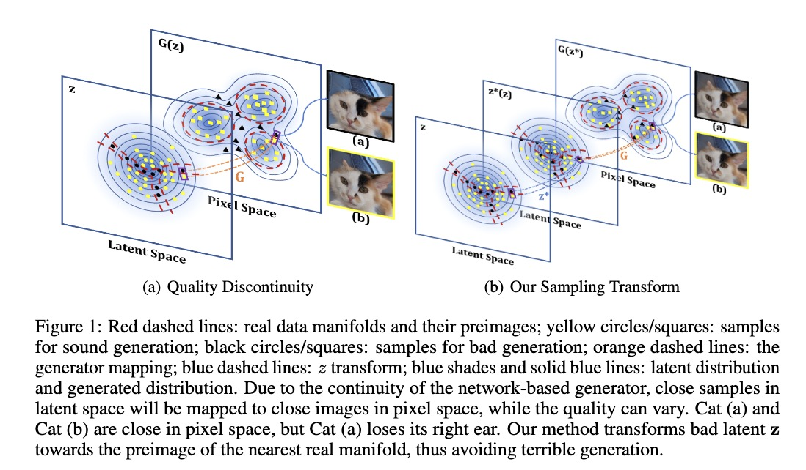

# AdvLatGAN
Official implementation of "Improving Generative Adversarial Networks via Adversarial Learning in Latent Space" published at NeurIPS 2022.



**A Brief Introduction:** This work investigate GAN by rethinking the role of the feed-forward generator as a continuous function. The generation pipeline suffers from the "too continuous" issue when it tries to match up with the real data distribution, which is supported on disjoint manifolds. Adopting adversarial techniques in latent space, we impose an extra (implicit) transform function on the raw Gaussian sampling in GANs to achieve generation performance gain. Introducing targeted sampling transform in GAN training alleviates training challenges and empowers more robust network training pipelines, while the sampling transform in inference (generation) time directly improve the generation quality. 

## Requirements

Python libraries required: `absl-py`,`scipy`,`tensorboardX`,`torch`,`torchvision`,`tqdm`,`pytorch-gan-metrics`.

You can run `pip install -r requirements.txt` to install all the libraries.

Preparing datasets
---

This repository involves image datasets including [CIFAR-10](https://www.cs.toronto.edu/~kriz/cifar.html), [STL-10](https://cs.stanford.edu/~acoates/stl10/), [LSUN](https://www.yf.io/p/lsun), [CelebA](https://mmlab.ie.cuhk.edu.hk/projects/CelebA.html) and [ImageNet](https://www.image-net.org).  CIFAR-10 and STL-10 will be automatically downloaded through the code, while LSUN, CelebA and ImageNet need to be prepared in advance. Download the datasets to the specified directories and check that the dataset paths in the code correspond to the actual paths (default: `./data/LSUN_church`,`./data/CelebA` and `./data/ImageNet`).

## Preparing files for metric calculating

Download npz files of datasets to folder `stats` for calculating FID. Download link: https://drive.google.com/drive/folders/1zcYxkt4J7ANGSzyy-Kt5QYfIjJvXFZ31?usp=sharing. To calaulate FID on other datasets, you can generate the corresponding npz files referring to https://github.com/w86763777/pytorch-gan-metrics.

## Training new networks

This repository include `dcgan`, `wgan`, `wgangp` and `sngan` as backbones. In its most basic form, training new networks boils down to:

```python
python [model_file] --flagfile [config_path]
```

Taking CIFAR-10 experiment as an example, to train baseline models:

```python
python dcgan.py --flagfile ./configs/cifar10/dcgan-baseline.txt
python wgan.py --flagfile ./configs/cifar10/wgan-baseline.txt
python wgangp.py --flagfile ./configs/cifar10/wgangp-baseline.txt
python sngan.py --flagfile ./configs/cifar10/sngan-baseline.txt
```

To train AdvLatGAN-qua on top of different backbones:

```python
python dcgan-qua.py --flagfile ./configs/cifar10/dcgan-qua.txt
python wgan-qua.py --flagfile ./configs/cifar10/wgan-qua.txt
python wgangp-qua.py --flagfile ./configs/cifar10/wgangp-qua.txt
python sngan-qua.py --flagfile ./configs/cifar10/sngan-qua.txt
```

AdvLatGAN-qua is able to train more powerful networks. The code will evaluate the generation quality via Inception Score (IS) and Fréchet Inception Distance (FID) by default.

The hyperparameters are controlled by the configuration files, located in `./configs/[dataset]/[model].txt`.

## AdvLatGAN-z: post-training latent space sampling improvement

To conduct AdvLatGAN-z i.e. latent space sampling shift for better generative quality, run:

```python
python sampling_shift.py --flagfile [config_path]
```

The configuration files are located in `./configs_test`. Specify the pre-trained model path through `--pretrain` in the confuguration files.

Taking CIFAR-10 experiment as an example, to conduct AdvLatGAN-z on models trained by AdvLatGAN-qua, i.e., evaluate AdvLatGAN-qua+ noted in the paper:

```python
python sampling_shift.py --flagfile ./condigs_test/dcgan-qua+.txt
python sampling_shift.py --flagfile ./condigs_test/wgan-qua+.txt
python sampling_shift.py --flagfile ./condigs_test/wgangp-qua+.txt
python sampling_shift.py --flagfile ./condigs_test/sngan-qua+.txt
```

The example configuration files are based on the default save paths of the models. If the model path is not default, please update it accordingly.

## Evaluation metrics

This repository include Inception Score (IS) and Fréchet Inception Distance (FID) as evaluation metrics. You can also evalute other metrics e.g. density and coverage via https://github.com/clovaai/generative-evaluation-prdc.

More information will be updated.

## Acknowledgements

This repository is built upon https://github.com/w86763777/pytorch-gan-collections and https://github.com/w86763777/pytorch-gan-metrics.
